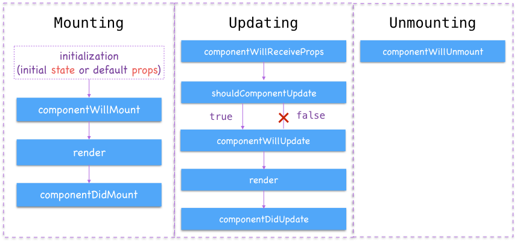
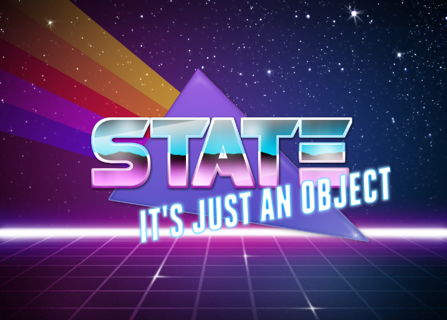

# React, State, and Lifecycle Methods

### Prerequisites

Students should be familiar with:

- React and React components
- Props and unidirectional data flow
- The immutability of props

### Learning Objectives

- Explain React state
- Describe the React component lifecycle
- Explain the most important lifecycle methods
- Implement a react component that fetches some data from the web
- Discuss React events

# React State

- **Props** are properties that one component passes to one of its child components. They only go in one direction, and they are _immutable_. 
- **State** allows us to add dynamic content to our components. Components can have local state that we can **set**. Every time a component's state changes, the component will re-render.

We declare state in our constructor, like this:

```jsx
import React, { Component } from 'react';

class MovieDiv extends Component {
constructor() {
    super();
    this.state = {
      title: null,
      releaseDate: null,
    };
  }

  render() {
    return (
      <div>
        <h1>Hello, world!</h1>
        <div>The title is {this.state.title}.</div>
      </div>
    );
  }
}
```

We update `state` with the built-in method `setState`. So, if we wanted to update the title in our `MovieDiv` component, we would say:

```jsx
this.setState({ title: 'Finding Nemo' });
```

Let's add this to a function in our `MovieDiv`.

```jsx
import React, { Component } from 'react';

class MovieDiv extends Component {
  constructor() {
    super();
    this.state = {
      title: null,
      releaseDate: null,
    };
    this.updateTitle = this.updateTitle.bind(this);
  }

  updateTitle() {
    this.setState({
      title: 'Finding Nemo',
    })
  }

  render() {
    console.log('render');
    return (
      <div>
        <h1>Hello, world!</h1>
        <h2>The title is {this.state.title}.</h2>
        <button onClick={this.updateTitle}>Update!</button>
      </div>
    );
  }
}
```

(Note that we have to use `bind` to preserve the context of `this`.)

#### SIDEBAR: React Events

Take a look at the docs to see a list of all of the events React has access to. You basically have access to all of the same events that the browser DOM gives you. Under the hood, React is taking care of all the `addEventListener()` stuff. We're using `onClick` in this example; we'll talk about some of the others later on.

### VERY IMPORTANT: How _not_ to update `state`

Never, ever, ever, _ever_ update `state` by saying something like:

```js
/*  🚨🚨🚨🚨 DO NOT DO THIS!!!!!!! 🚨🚨🚨🚨🚨🚨🚨 */
this.state.title = 'Finding Nemo';
```


Instead, you **MUST USE** the `setState` method, like we did above.

```js
this.setState({ title: 'Finding Nemo' });
```

If we want to add items to an array in our state, we can't use `push`, since `push` mutates the original array. Instead, we need to use `concat`, which returns a new array with the new value on the end.

Let's say instead of just a string in our title, we want to have an array of movies:

```jsx
this.state = {
  title: [<h2>Finding Nemo</h2>]
}

addAnotherMovie() {
  this.setState({
    title: this.state.title.concat(<h2>Back to the Future</h2>);
  })
}
```

Note that we also **ABSOLUTELY CANNOT** set a new variable equal to `this.state` and then mutate that object.

```jsx
/*  🚨🚨🚨🚨 DO NOT DO THIS!!!!!!! 🚨🚨🚨🚨🚨🚨🚨 */
const newState = this.state;
newState.title = [<h2>Finding Nemo</h2>, <h2>Back to the Future</h2>];
this.setState(newState);
```

This is because JavaScript doesn't make _copies_ of objects, it makes _references to_ the original object. This is called "passing by reference".

.

If we want to accomplish something like this, we would instead have to take a copy of the object using spread syntax:

```jsx
const newState = { ...this.state };
newState.title = [<h2>Finding Nemo</h2>, <h2>Back to the Future</h2>];
this.setState(newState);
```

...but you shouldn't really do this either, since it's not very performant.

The other way we can update `state` is by passing `setState` a callback function rather than an object. Doing this can be helpful if you're running into bugs, since it explicitly references the previous version of the state.

```jsx
addAnotherMovie() {
  this.setState(prevState => {
    return {
      title: prevState.title.concat(<h2>Back to the Future</h2>);
    }
  })
}
```

### Let's make another example!

I'll be building up to the `widgets-example-begin` app.

## 🚀 Lab 1 - Color Switcher - 20min

[Fork and clone this repo and follow the instructions!](https://git.generalassemb.ly/wdi-nyc-narwhal/U03-D04-COLOR-DIV-LAB) 

You can work in pairs for this one, provided by our handy scrambler.

# React Component Lifecycle



Lifecycle methods describe the timeline of a React component's existence. They allow us to do things based on how the page loads. Let's add a lifecycle method to our movies example:

```js
class MovieDiv extends Component {
  constructor() {
    super();
    this.state = {
      title: null,
      releaseYear: null,
    };
    this.updateMovie = this.updateMovie.bind(this);
    this.addAnotherMovie = this.addAnotherMovie.bind(this);
  }

  componentDidMount() {
    console.log('did mount');
  }

  updateMovie() {
    this.setState({
      title: [<h2>Star Wars</h2>, <h2>Finding Nemo</h2>],
    });
  }

  addAnotherMovie() {
    console.log(this.state);
    this.setState(prevState => {
      title: prevState.concat(<h2>Back to the Future</h2>);
    })
  }

  render() {
    console.log('render');
    return (
      <div className="movie-info">
        <h2>Welcome to my movie app!</h2>
        <h2>The title is {this.state.title}.</h2>
        <button onClick={this.updateMovie}>Update Movie</button>
        <button onClick={this.addAnotherMovie}>Add Movie</button>
      </div>
    );
  }
}
```

Let's add a few more lifecycle methods:

```js
  componentWillMount() {
    console.log('will mount');
  }

  componentDidMount() {
    console.log('did mount');
  }

  componentWillUpdate() {
    console.log('will update');
  }

  componentDidUpdate() {
    console.log('did update');
  }
```

Now every time we start the app, the `componentDidMount` method fires.

#### NOTE: In your react classes, the constructor should appear up top, followed by lifecycle methods, then your own methods, then the render method. This is a best practice.

Let's separate the movie title div out into its own component and add some lifecycle methods to it as well.

```js
  
  componentWillReceiveProps(props) {
    console.log('subcomponent will receive props');
    console.log(props);
  }

  componentWillUpdate() {
    console.log('subcomponent will update');
  }

  componentDidUpdate() {
    console.log('subcomponent did update');
  }
```

Now when we run our movies app and make changes, we can see at what point each lifecycle method is fired.

### Fetching data within a React component

If you need to fetch data when the component loads, you'd do it in the `componentDidMount` lifecycle methods. This ensures that the component loads quickly, without waiting for data -- for example, if the request loads slowly.

Let's add an API call to our movie example:

In `App.js`:

```js
componentDidMount() {
  axios.get('http://batman-info.herokuapp.com/api/batman')
    .then(res => {
      const batmanTitles = res.data.Search.map(movie => {
        return <h2>{movie.Title}</h2>;
      });
      this.setState({
        batmanList: batmanTitles,
      })
    })
}
```

Then we can use that data in the component's render method.

### Another example fetching data using lifecycle methods

Let's say we wanted to add the NASA pic of the day to our NASA widget. What are some ways we could go about doing that? Where could we make that call? There are a couple of different ways to do this:

- Load the NASA data as soon as the app mounts (`componentDidMount`)
- Load the NASA data when the NASA button is clicked and pass it to the child component (`componentDidUpdate`)
- Load the NASA data in the child component when its prop `widgetType` is `'NASA'` (`componentWillReceiveProps`)

## 🚀 Lab 2 - Start Wars - 45min

[Fork and clone this repo and follow the instructions!](https://git.generalassemb.ly/wdi-nyc-narwhal/U03-D04-Star-Wars-LAB)

You'll be working in pairs again for this, provided by our handy scrambler.

# Recap!



- `state` is an object that React watches to decide when to rerun the `render` method.
- Every time `state` changes, unless we specifically tell it not to, the component will re-render.
- We change `state` by using the `setState` method that React provides us.
- The page does not refresh when `state` changes.


- Lifecycle methods describe the flow of a react component's existence.
- Sometimes we can call `setState` within lifecycle methods and not trigger a re-render. This occurs during cycles where the `render` method is already present within the cycle, such as `componentDidUpdate` and `componentWillReceiveProps`.
- If we want data to initially be present when our app loads, we should make that call within `componentDidMount`
