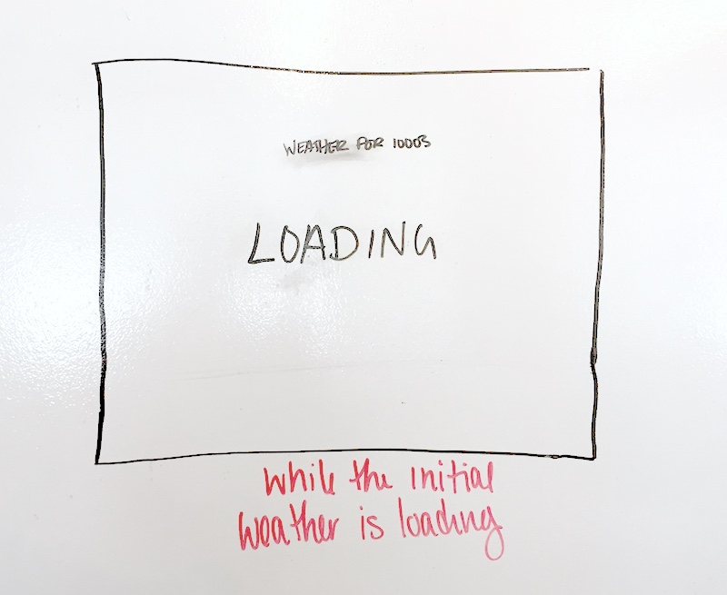
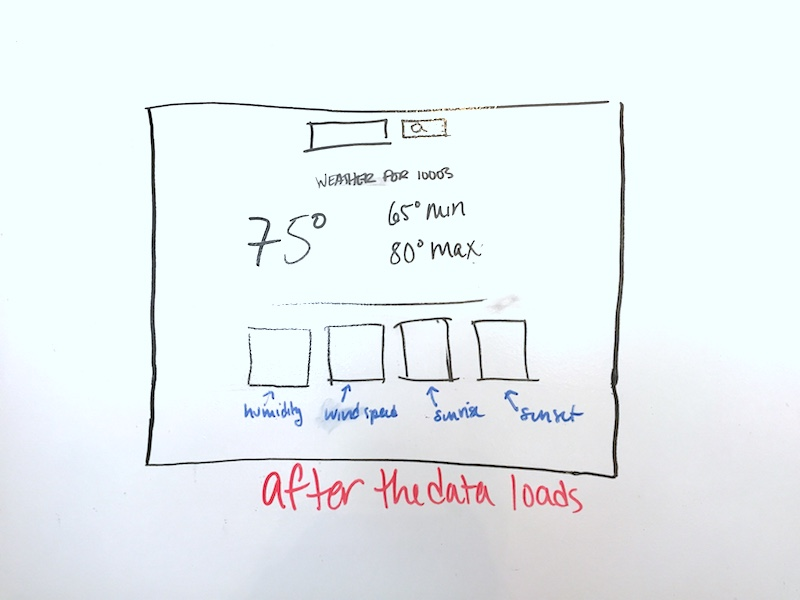

# React Weather!!

TONIGHT, you'll be building a weather app using React!!

You'll be using the [Open Weather API](https://openweathermap.org/api) that we've used before a couple of times.

## Wireframes!!

To describe these wireframes with words:

- When the page first loads, it should display a "Loading" message. This is because it will be making an API call to the Open Weather API.
    - This means that we'll need to set an initial zip code in the state for it to access.
- Once the API data comes back, it should display the weather for zip code `10003` (GA's zip code!!).
- **BONUS**: If the temp is above 80, it shows up in red; if it is below 50, it shows up in blue.
- **BONUS 2**: Put in an input field that has an `onChange` method that lets you search for the weather in any zipcode!

### Before you start!

- What initial values will you need to have in state?
- What components will you need to make?
- When would you need to make your API call?
